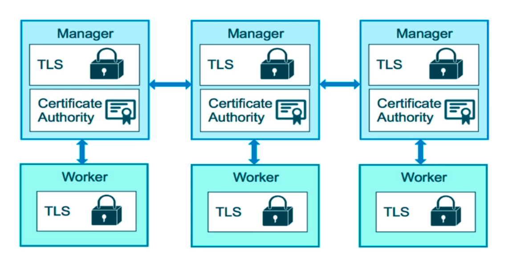
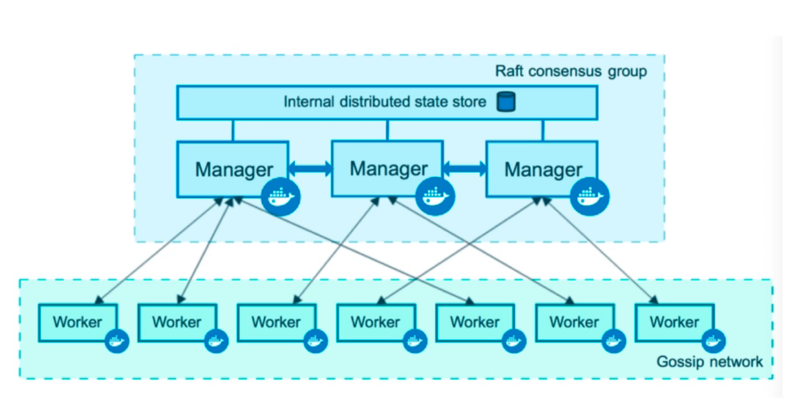
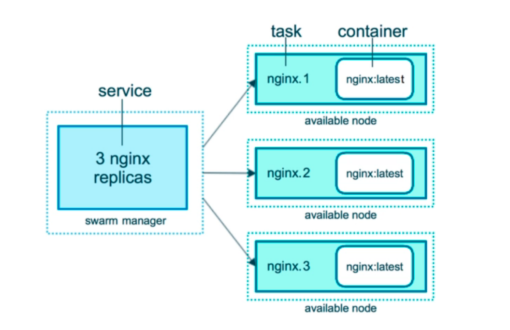
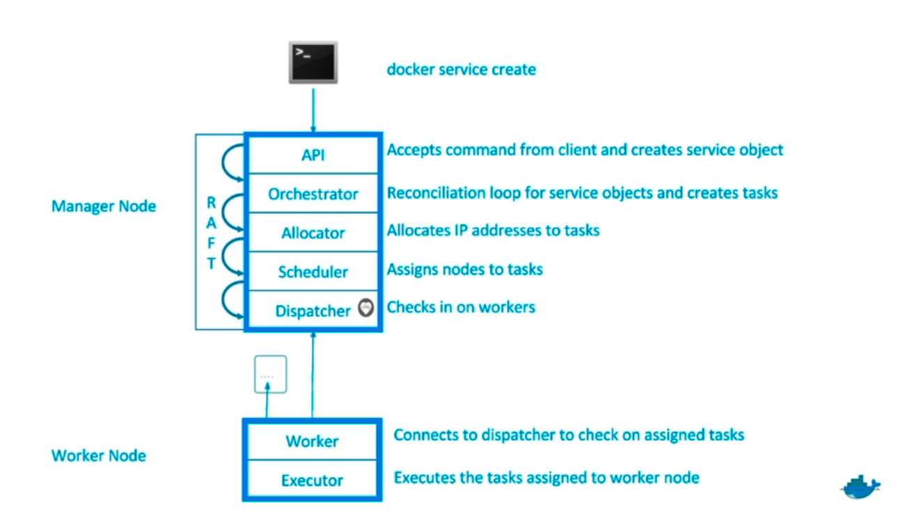
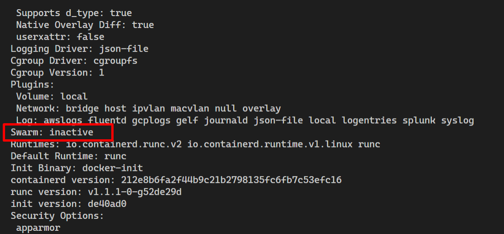

# Docker Swarm Mode

## New Problems

- Containers everywhere
- How do we automate container lifecycle?
- How can we easily scale out/in/up/down?
- How can we ensure our containers are re-created if they fail?
- How can we replace containers without downtime (blue/green deploy)?
- How can we control/track where containers get started?
- How can we create cross-node virtual networks?
- How can we ensure only trusted servers run on our containers?
- How can we store secrets, keys, passwords and get them to the right container (and only that container)?

## Swarm Mode: Built-in Orchestration

- Swarm Mode is a clustering solution built inside Docker
- Not related to Swarm "classic" pre-1.12 versions
- Added in 1.12 (Summer 2016) via SwarmKit toolkit
- Enhanced 1.13 (January 2017) via Stacks and Secrets
- Not enabled by default, new commands once enabled
  - docker swarm
  - docker node
  - docker service
  - docker stack
  - docker secret

## Docker Swarm Components



 - **Node**: A node is an instance of the Docker engine participating in the swarm. You can also think of this as a Docker node. You can run one or more nodes on a single physical computer or cloud server, but production swarm deployments typically include Docker nodes distributed across multiple physical and cloud machines.
 - **Manager**: To deploy your application to a swarm, you submit a service definition to a manager node. The manager node dispatches units of work called tasks to worker nodes. Manager nodes also perform the orchestration and cluster management functions required to maintain the desired state of the swarm. Manager nodes elect a single leader to conduct orchestration tasks.
 - **TLS**: Each node in the swarm enforces TLS mutual authentication and encryption to secure communications between itself and all other nodes.
 - **Certificate Authority**: You have the option to use self-signed root certificates or certificates from a custom root CA.
 - **Worker**: Worker nodes receive and execute tasks dispatched from manager nodes. By default manager nodes also run services as worker nodes, but you can configure them to run manager tasks exclusively and be manager-only nodes. An agent runs on each worker node and reports on the tasks assigned to it. The worker node notifies the manager node of the current state of its assigned tasks so that the manager can maintain the desired state of each worker.
 - **Raft Consensus Group**: When the Docker Engine runs in swarm mode, manager nodes implement the [Raft Consensus Algorithm](http://thesecretlivesofdata.com/raft/) to manage the global cluster state. The reason why Docker swarm mode is using a consensus algorithm is to make sure that all the manager nodes that are in charge of managing and scheduling tasks in the cluster, are storing the same consistent state. Having the same consistent state across the cluster means that in case of a failure, any Manager node can pick up the tasks and restore the services to a stable state. For example, if the Leader Manager which is responsible for scheduling tasks in the cluster dies unexpectedly, any other Manager can pick up the task of scheduling and re-balance tasks to match the desired state.
 

 ## Docker Service Command

 The Docker Service command will replace docker run to implement the cluster features of swarm mode. 

 

 For instance, if we run the ```docker service create``` command specifying a container task and three replicas, the Docker service will create the same container in three different workers and decides where in the swarm to place those. By default it will spread across the swarm. 

 ## How Managers work

 The Docker Service API have a bunch of services that runs in the  manager node to manage the containers in the workers nodes. 

  

## Create your first Swarm Service
Follow the steps bellow:
1. Check if Docker Swarm is active. 
   ```bash
   docker info
   ```
2. The output will indicate if docker swarm is active or inactive. 
   
3. Initialize swarm.
   ```bash
   docker swarm init
   ```
4. The output will tell the service api is running. 
    ```bash
    Swarm initialized: current node (no0tpv7m062v8s2u4rn04vava) is now a manager.

    To add a worker to this swarm, run the following command:

        docker swarm join --token SWMTKN-1-3skpbaoisddvmvdixfl9pcyvg89zyng9if9to07ar0m6xnm4wg-2i0z3f80dr9pkwf2bqknrlg4m 10.0.2.15:2377

    To add a manager to this swarm, run 'docker swarm join-token manager' and follow the instructions.
    ```
5. Check the list of options the docker service provides.
   ```bash
   docker service --help
   ```
6. If succeed the command will list the COMMAND options. 
    ```bash
    Usage:  docker service COMMAND

    Manage services

    Commands:
      create      Create a new service
      inspect     Display detailed information on one or more services
      logs        Fetch the logs of a service or task
      ls          List services
      ps          List the tasks of one or more services
      rm          Remove one or more services
      rollback    Revert changes to a service's configuration
      scale       Scale one or multiple replicated services
      update      Update a service

    Run 'docker service COMMAND --help' for more information on a command.
    ```
7. Running a simple alpine container to ping Google dns. 
    ```bash
    docker service create alpine ping 8.8.8.8
    ```
8. Checking if service is running.
    ```bash
    docker service ls
    ```
9. Locate and copy the id of the service we just ran.  
10. To scale out in three new replicas the container run the following command. 
  
    > **Note**: change the [service-id] with the value you copied before. Don't forget to remove the brackets. 
    ```bash
    docker service update [service-id] --replicas 3 
    ```
11. Check that the replicas are running.
    ```bash
    docker service ls
    ```
12. The output will show the service number of replicas. 
    ```bash
    ID             NAME                  MODE         REPLICAS   IMAGE
    tisf5pyxne75   kind_fermi            replicated   3/3        alpine:latest   
    ```
13. You can manage the container resources through the docker service update command. To see the list of options run the following command.
    ```bash
    docker service update --help
    ```
14. For example, to limit the memory usage of the containers in a swarm service to 6MB use the following command.
    ```bash
    docker service update [service-id] --limit-memory 6MB
    ```
    > **Note**: Remember to change the [service-id] with the respective service id. 
15. To check the memory limit of the service run the following command overwriting the [service-id] with your service id. 
    ```bash
     docker service inspect --pretty [service-id]
    ```
16. To identify the name of the container run docker container ls command. The command will show the list of containers. The container name in a cluster is composed of [name].[number].[ID] where:
    - **[name]** is the service name
    - **[number]** is the replica number
    - **[ID]** is the container ID
  
    For example:
    ```bash
    docker container ls
    ```

    Sample output:
    ```bash
    CONTAINER ID   IMAGE                           COMMAND                  CREATED             STATUS             PORTS                          NAMES
    0fa345092aa5   alpine:latest                   "ping 8.8.8.8"           14 minutes ago      Up 14 minutes                                     kind_fermi.2.oxnykzxh42se91t9rf8cydors
    9b44c796e33d   alpine:latest                   "ping 8.8.8.8"           14 minutes ago      Up 14 minutes                                     kind_fermi.1.3ik7wlb3hru8ztks0ra4jseul
    49f075ab6878   alpine:latest                   "ping 8.8.8.8"           14 minutes ago      Up 14 minutes                                     kind_fermi.3.sga2dqec0di515egnfscfk92p
    ```

17. Try to remove one of the replicas, running the following command overwriting the [container-name] with the appropriate container name you want to remove from the cluster. 
    ```bash
    docker container rm -f [container-name]
    ```
18. Run docker service ls to see if the number of replicas is updated. 
    ```bash
    docker service ls
    ```
19. You will see that the container is up again and the replica number still 3 of 3. That's because the managers will restore the state of the container to maintain service state consistency. 
    ```bash
    ID             NAME                  MODE         REPLICAS   IMAGE                           PORTS
    tisf5pyxne75   kind_fermi            replicated   3/3        alpine:latest                   
    vc799gyoi8n6   portainer_agent       global       1/1        portainer/agent:2.14.0 
    ```
20. To check the history of changes in the service you can do a docker service ps with the name of the service. For example:
    ```bash
    docker service ps kind_fermi
    ```

    Sample output:
    ```bash
    ID             NAME               IMAGE           NODE      DESIRED STATE   CURRENT STATE             ERROR                              PORTS
    3ik7wlb3hru8   kind_fermi.1       alpine:latest   focal     Running         Running 26 minutes ago                                       
    uplp4t2m5iwq    \_ kind_fermi.1   alpine:latest   focal     Shutdown        Rejected 26 minutes ago   "Minimum memory limit allowed …"   
    orqzghhd3l9g    \_ kind_fermi.1   alpine:latest   focal     Shutdown        Shutdown 26 minutes ago                                      
    bn3fnvd35di2   kind_fermi.2       alpine:latest   focal     Running         Running 4 minutes ago                                        
    oxnykzxh42se    \_ kind_fermi.2   alpine:latest   focal     Shutdown        Failed 5 minutes ago      "task: non-zero exit (137)"        
    oy5ty7h0b1ux    \_ kind_fermi.2   alpine:latest   focal     Shutdown        Shutdown 26 minutes ago                                      
    sga2dqec0di5   kind_fermi.3       alpine:latest   focal     Running         Running 26 minutes ago                                       
    rmvxyfjkplt9    \_ kind_fermi.3   alpine:latest   focal     Shutdown        Rejected 26 minutes ago   "Minimum memory limit allowed …"   
    0w6x5r3odicx    \_ kind_fermi.3   alpine:latest   focal     Shutdown        Rejected 26 minutes ago   "Minimum memory limit allowed …"   
    ivyjtw532c2x    \_ kind_fermi.3   alpine:latest   focal     Shutdown        Rejected 26 minutes ago   "Minimum memory limit allowed …"   
    mn59ri99pzfq    \_ kind_fermi.3   alpine:latest   focal     Shutdown        Rejected 27 minutes ago   "Minimum memory limit allowed …"    
    ```

21. To effectively remove the containers in a cluster you have to run the docker service rm. For example:

    ```bash
     docker service rm kind_fermi 
    ```

## References

- [Deploy services to a swarm](https://docs.docker.com/engine/swarm/services/)
- [Swarm mode overview](https://docs.docker.com/engine/swarm/)
- [Swarm mode key concepts](https://docs.docker.com/engine/swarm/key-concepts/)
- [Getting started with swarm mode](https://docs.docker.com/engine/swarm/swarm-tutorial/)


